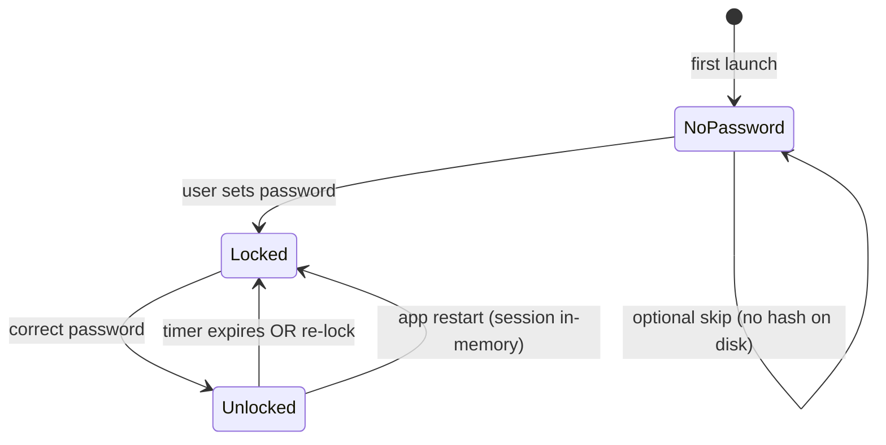

# Blocking list lock (password + timed unlock)

Protect **weakening** the block list (remove rules, turn rules off) with a **local password** and a **short unlock session** (~5 minutes by default), while **adding** rules stays easy.

## Related docs

- **Unlock modes (password vs friction game, hybrid, friend):** [`unlock-modes.md`](./unlock-modes.md)
- Sync architecture: [`../02-blocage/custom_blocking_sync_architecture_2026-03-29.md`](../02-blocage/custom_blocking_sync_architecture_2026-03-29.md)
- UX decisions (password scope, recovery): agreed in product discussion 2026-03-29

## Problem

Users want blocking to feel **sticky**: casual “one tap remove” undermines the system. A **desktop-only** gate raises the cost of undoing protection without pretending to stop a determined attacker with full machine access.

## Goals

| Goal | Detail |
|------|--------|
| Friction on weaken | Removing a rule or turning it **off** requires an **unlock session** after password entry. |
| Easy strengthen | **Add** URL/search rules and **turn rules on** without unlocking. |
| Timed session | After correct password, **manage** actions allowed for **X minutes** (default **5**), then auto re-lock. |
| Manual re-lock | **Re-lock now** ends the session immediately. |
| Honest security | Password stored as a **hash** on disk; unlock state held in the **app process** (see limitations). |

## Non-goals (v1)

- **Forgot-password recovery** (counting grids, cooldowns) — roadmap **Phase 2**.
- **Extension UI** for remove/disable custom rules — v1 keeps **management in desktop**; extension continues to **apply** synced rules.
- **Server-side** enforcement of the lock (lock is **local** to the Clarity desktop app).

## Limitations (user-visible copy)

> This stops casual changes on this computer. Someone with full access to the machine could still tamper with app data or uninstall software. Stricter models (OS profiles, accountability partners) are out of scope for v1.

## State machine

- **No password on disk:** destructive actions are **allowed** (same as today). User can **set password** from Blocking.
- **Password set, session expired / relocked:** **remove** and **toggle off** disabled; **add** and **toggle on** enabled.
- **Unlocked:** full table edits until `unlocked_until`.

## Implementation phases

### Phase 1 (shipped in app)

- [x] Roadmap + spec (this folder)
- [x] `~/.clarity/blocking-lock.json`: version, Argon2 **password hash**, `unlock_duration_secs` (default 300)
- [x] Tauri commands: `blocking_lock_get_status`, `blocking_lock_set_password`, `blocking_lock_verify_unlock`, `blocking_lock_relock`
- [x] In-memory unlock expiry (cleared on app quit)
- [x] **Blocking** tab: `BlockingLockPanel` (set password, unlock, countdown, re-lock, change password when unlocked)
- [x] Gate **Remove** and **toggle off** when locked (`canManageDestructive` from Rust)

### Phase 2 — Recovery & friction

See [`unlock-modes.md`](./unlock-modes.md) for **password vs friction-only** and hybrid options.

- [ ] **Phase 2a (optional):** Friction-only lock path (challenge to unlock; no password)
- [ ] **Phase 2b (optional):** “Forgot password” → friction flow → **set new password** (invalidate old hash)
- [ ] Rate limits / cooldown between attempts where relevant

### Phase 3 — Hardening (optional)

- [ ] Persist unlock preference (duration) only editable while unlocked
- [ ] Extension: hide remove path or deep-link to desktop
- [ ] Audit log of unlock events (local only)

## File layout (code)

| Area | Files |
|------|--------|
| Rust | `apps/desktop/src-tauri/src/blocking_lock.rs`, `lib.rs` |
| React | `hooks/useBlockingLock.ts`, `BlockingUnlockModal.tsx`, `BlockingSetPasswordModal.tsx` (or inline), `BlockingTab.tsx` |

## Open questions (later)

- Minimum password length (v1: **8** characters).
- Whether **Screen Time → Add to block list** should require unlock (current product answer: **no**).
